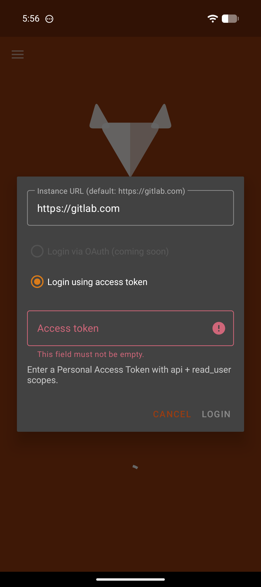
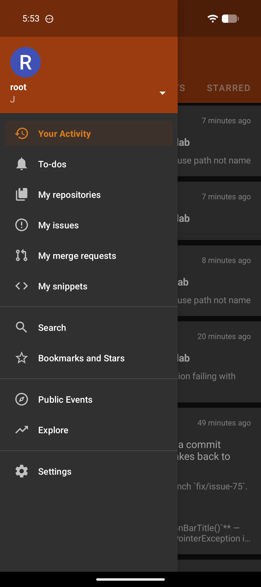
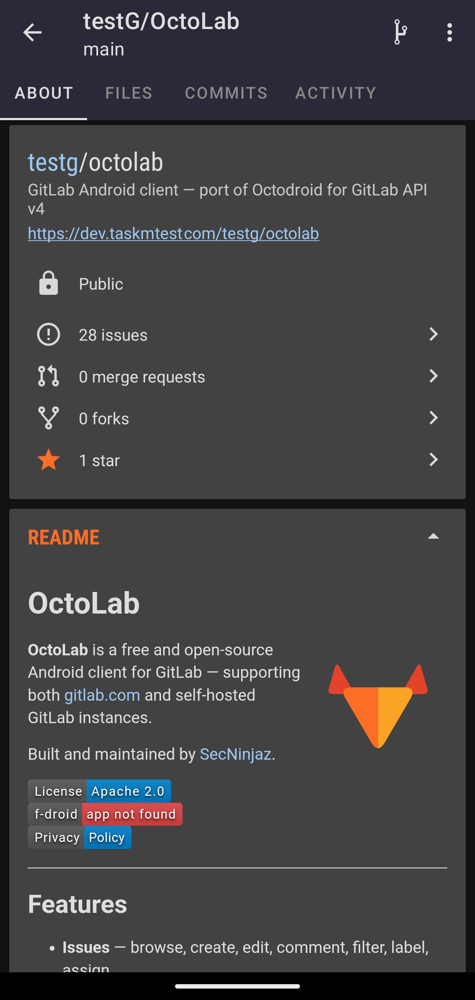

# OctoLab


**OctoLab** is a free and open-source Android client for GitLab — supporting both [gitlab.com](https://gitlab.com) and self-hosted GitLab instances.

Built and maintained by [SecNinjaz](https://secninjaz.com).

[](LICENSE)
[](https://f-droid.org/packages/com.secninjaz.octolab)
[](PRIVACY.md)

---

## Features

- **Issues** — browse, create, edit, comment, filter, label, assign
- **Merge Requests** — view, comment, review diffs, navigate pipelines
- **To-dos** — view and filter by action type (assigned, mentioned, review requested, etc.)
- **Your Activity** — event feed, your projects' activity, starred projects' activity
- **Repository** — browse files, README, branches, tags, commits, releases
- **Notifications** — push notifications for new to-do items
- **Self-hosted support** — works with any GitLab instance (CE or EE)
- **Multi-account** — add and switch between multiple GitLab accounts (self-hosted + gitlab.com)
- **Authentication** — Personal Access Token (PAT) login (OAuth2 coming soon)
- **Dark / Light mode**
- **Markdown rendering** — GFM tables, task lists, code blocks, images

---

## Screenshots

<p float="left">
  
  
  
</p>

---

## Installation

### GitHub Releases
Download the latest signed APK from [Releases](https://github.com/secninjaz/OctoLab/releases).

### Obtainium (recommended for auto-updates)
[](https://apps.obtainium.imranr.dev/redirect.html?r=obtainium://add/https://github.com/secninjaz/OctoLab)

Fetches APKs directly from GitHub Releases and keeps the app updated automatically.

### F-Droid *(coming soon)*
Submission to F-Droid is in progress. The F-Droid badge will be added once the app is accepted into the repository.

---

## Building from Source

### Requirements
- Android Studio or Android SDK (API 36, Build Tools 36)
- Java 21
- A GitLab account (gitlab.com or self-hosted)

### Setup

1. Clone the repo:
   ```bash
   git clone https://github.com/secninjaz/octolab.git
   cd octolab
   ```

2. Create `app/client.properties` with your GitLab OAuth app credentials:
   ```
   ClientId="YOUR_GITLAB_CLIENT_ID"
   ClientSecret="YOUR_GITLAB_CLIENT_SECRET"
   ```
   To create an OAuth app: GitLab → User Settings → Applications → Add new application
   - Redirect URI: `gl4a://oauth`
   - Scopes: `api`, `read_user`, `read_repository`, `write_repository`, `openid`

3. Build:
   ```bash
   ./gradlew assembleDebug
   ```

The APK will be at `app/build/outputs/apk/debug/app-debug.apk`.

---

## Login

- **OAuth** — opens your GitLab instance in the browser to authorize
- **Access Token** — enter a Personal Access Token with `api` + `read_user` scopes
- **Instance URL** — defaults to `https://gitlab.com`, change to your self-hosted URL

---

## Contributing

See [CONTRIBUTING.md](CONTRIBUTING.md).

## AI-assisted development

This project uses [Claude Code](https://claude.ai/code) as a development assistant. The `.claude/` directory is intentionally excluded from version control — it contains local workflow settings specific to the development environment and does not affect the app's behaviour or security.

All code changes — including those suggested by AI — are reviewed, tested, and committed by a human maintainer. AI assistance does not replace code review, security scanning, or the project's standard release process (which includes SAST, dependency scanning, and MobSF static analysis on every release).

---

## Security

See [SECURITY.md](SECURITY.md) for how to report vulnerabilities.

---

## Privacy

OctoLab has no backend servers of its own. All communication happens directly between your device and the GitLab instance(s) you configure — no data passes through any SecNinjaz infrastructure.

See [PRIVACY.md](PRIVACY.md) for the full privacy policy.

---

## Standing on the Shoulders of Giants

OctoLab would not exist without the exceptional work of the [Octodroid](https://github.com/slapperwan/gh4a) team. Octodroid is a beautifully crafted, open-source GitHub client for Android — and it provided the entire foundation that OctoLab is built upon.

We are deeply grateful to the Octodroid contributors:

- **[slapperwan](https://github.com/slapperwan)** — creator and primary maintainer
- **[maniac103](https://github.com/maniac103)** — major contributor
- **[kageiit](https://github.com/kageiit)** — contributor
- **[Tunous](https://github.com/Tunous)** — contributor
- All other contributors who made Octodroid what it is

OctoLab is a GitLab port of Octodroid, maintained by [SecNinjaz](https://secninjaz.com). All original Octodroid code remains under the [Apache License 2.0](LICENSE). If you appreciate OctoLab, please also star and support the [Octodroid project](https://github.com/slapperwan/gh4a).

---

## License

[Apache License 2.0](LICENSE)
